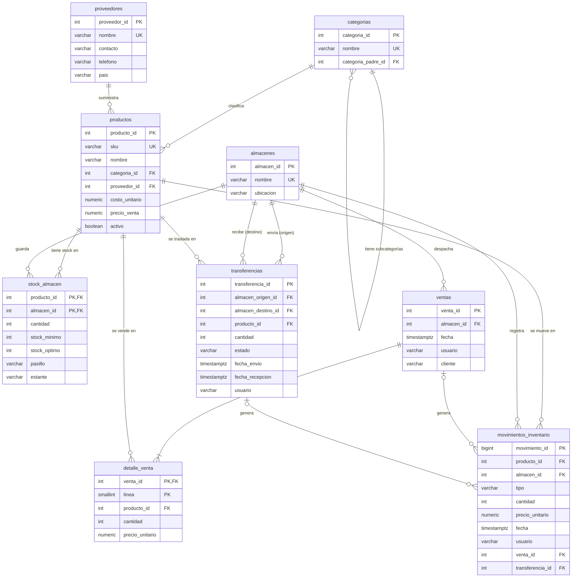

# Diagrama entidad-relación

```mermaid
erDiagram
    categorias ||--o{ categorias : "tiene subcategorías"
    categorias ||--o{ productos : "clasifica"
    proveedores ||--o{ productos : "suministra"
    productos ||--o{ stock_almacen : "tiene stock en"
    almacenes ||--o{ stock_almacen : "guarda"
    almacenes ||--o{ ventas : "despacha"
    ventas ||--|{ detalle_venta : "contiene"
    productos ||--o{ detalle_venta : "se vende en"
    almacenes ||--o{ transferencias : "envía (origen)"
    almacenes ||--o{ transferencias : "recibe (destino)"
    productos ||--o{ transferencias : "se traslada en"
    productos ||--o{ movimientos_inventario : "se mueve en"
    almacenes ||--o{ movimientos_inventario : "registra"
    ventas |o--o{ movimientos_inventario : "genera"
    transferencias |o--o{ movimientos_inventario : "genera"

    categorias {
        int categoria_id PK
        varchar nombre UK
        int categoria_padre_id FK
    }
    proveedores {
        int proveedor_id PK
        varchar nombre UK
        varchar contacto
        varchar telefono
        varchar pais
    }
    almacenes {
        int almacen_id PK
        varchar nombre UK
        varchar ubicacion
    }
    productos {
        int producto_id PK
        varchar sku UK
        varchar nombre
        int categoria_id FK
        int proveedor_id FK
        numeric costo_unitario
        numeric precio_venta
        boolean activo
    }
    stock_almacen {
        int producto_id PK, FK
        int almacen_id PK, FK
        int cantidad
        int stock_minimo
        int stock_optimo
        varchar pasillo
        varchar estante
    }
    ventas {
        int venta_id PK
        int almacen_id FK
        timestamptz fecha
        varchar usuario
        varchar cliente
    }
    detalle_venta {
        int venta_id PK, FK
        smallint linea PK
        int producto_id FK
        int cantidad
        numeric precio_unitario
    }
    transferencias {
        int transferencia_id PK
        int almacen_origen_id FK
        int almacen_destino_id FK
        int producto_id FK
        int cantidad
        varchar estado
        timestamptz fecha_envio
        timestamptz fecha_recepcion
        varchar usuario
    }
    movimientos_inventario {
        bigint movimiento_id PK
        int producto_id FK
        int almacen_id FK
        varchar tipo
        int cantidad
        numeric precio_unitario
        timestamptz fecha
        varchar usuario
        int venta_id FK
        int transferencia_id FK
    }
```